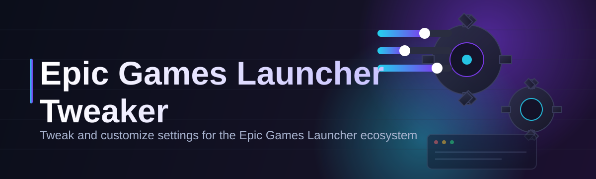
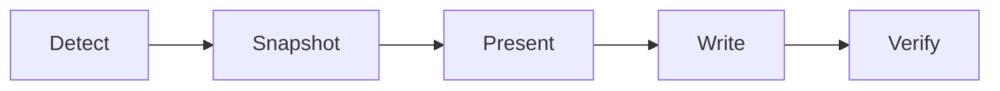

# epic-games-launcher-configurator 🚀🎮

  

*Turn the Epic Games Launcher from a heavy, opinionated storefront into a lean, quiet piece of software that actually respects your machine.*

  

## 🧭 Overview

The Epic Games Launcher is a strange piece of software — it's a storefront, a social layer, a background updater, and a telemetry collector all bundled into one process that insists on starting with Windows. **epic-games-launcher-configurator** exists because none of that has to be true at once. This project is a focused configuration tool — an *Epic Games Launcher Tweaker* — built specifically to give you a control panel over the settings that Epic itself hides, buries in JSON files, or simply never exposes in the UI.

The idea behind this tool isn't to replace the launcher or interfere with your library — it's to sit beside it as a companion utility that reads and rewrites the launcher's own configuration surface safely. Think of it less like a patch and more like a translator: it takes the toggles you actually want (startup behavior, background services, overlay presence, update cadence, interface scaling) and writes them into the places the launcher already understands. Nothing about your account, your purchases, or your installed games is touched.

This is for the player who wants Epic's storefront without Epic's overhead — the person running a lean gaming rig, a laptop where every background process matters, or a multi-launcher setup where one client shouldn't be hogging resources while another game is running. If you've ever closed the Epic Games Launcher only to find it quietly relaunched itself, this tool was built with you in mind.

> [!NOTE]
> This tool modifies local configuration files that the Epic Games Launcher itself creates and reads. It does not modify game files, account data, or communicate with Epic's servers.

---

## ⚡ What It Actually Gives You

**Startup Discipline** — Stop the launcher from auto-launching with Windows, or from silently relaunching itself after you close it. You decide when it opens, not the other way around.

**Background Process Trimming** — Disable the auxiliary services and helper processes that idle in the background even when no game is running, freeing up RAM and CPU cycles for what you're actually doing.

**Overlay Control** — Toggle the in-game overlay independently of the launcher itself, useful for reducing input latency or avoiding conflicts with other overlays (streaming software, other launchers, accessibility tools).

**Update Cadence Tuning** — Adjust when and how aggressively the launcher checks for and downloads updates, so a big patch doesn't start pulling bandwidth mid-session.

**Interface & Scaling Adjustments** — Fine-tune UI scale, window behavior, and rendering hints for high-DPI displays or unconventional monitor setups where the default launcher UI looks cramped or oversized.

**Network Behavior Shaping** — Cap or throttle background download behavior so the launcher doesn't compete with your active downloads, streams, or online matches.

**Config Snapshotting** — Every change is backed up before it's written, so you can always step back to the exact state you started from.

**Portable, Standalone Operation** — No installer wizard, no background service of its own, no silent updater phoning home. It runs, it does its job, it gets out of the way.

> [!TIP]
> Run a snapshot before your first tweak session. It takes two seconds and it's the safety net that makes experimenting with settings actually comfortable.

---

## 🏁 Getting Off the Ground

1. Visit the project landing page using the download button above.

2. Grab the latest standalone build — no bundled installer, no third-party bloat.

3. Run the executable directly. Windows may show a SmartScreen prompt for unsigned apps — click "More info" → "Run anyway."

4. Close the Epic Games Launcher fully (check your system tray) before applying any tweaks, so the changes write cleanly.

> [!IMPORTANT]
> Always fully quit the Epic Games Launcher — including its tray icon — before applying changes. Writing config while the launcher process is still active can cause your edits to be silently overwritten on next launch.

---

## 🖥️ System Requirements

| Requirement | Details |
|---|---|
| OS | Windows 10 (64-bit) or Windows 11 |
| Epic Games Launcher | Any recent version installed |
| Dependencies | None — fully standalone executable |
| Disk Space | Under 20 MB |
| Admin Rights | Not required for most tweaks; optional for a few startup-related toggles |

  

---

## 🛠️ How It Works

The architecture is deliberately simple, because a configuration tool should never be more complex than the thing it's configuring. Here's the flow behind every tweak you apply:

1. **Detect** — The tool locates your local Epic Games Launcher installation and its configuration directory.

2. **Snapshot** — Before touching anything, it copies the current config state so you have a rollback point.

3. **Present** — Settings are translated from raw config keys into plain-language toggles inside the UI.

4. **Write** — When you apply changes, they're written back into the launcher's own config format — nothing proprietary, nothing hidden.

5. **Verify** — The tool re-reads the file after writing to confirm the change actually took.

> [!NOTE]
> Because the tool writes directly into the launcher's own recognized config format, an Epic Games update can occasionally reset settings to default. This is expected — just reapply your tweaks after major launcher updates.

---

## 🩹 Troubleshooting Corner

<strong>The launcher still starts with Windows after I disabled it.</strong>

 

Check Windows Task Manager's Startup tab directly — some installations register startup entries in more than one place, and a recent Epic update may have re-added its own entry. Reapply the tweak and restart your machine.

<strong>My changes reverted after an Epic Games Launcher update.</strong>

 

This is normal. Launcher updates frequently rewrite their own config files. Reopen the tool and reapply your preferred settings — it takes seconds.

<strong>Windows SmartScreen is blocking the executable.</strong>

 

This happens with unsigned independent tools. Click "More info" then "Run anyway." The binary is not modified between builds — you can verify this yourself by comparing hashes across versions.

<strong>The overlay toggle didn't apply to a specific game.</strong>

 

Some titles manage their own overlay hooks independently of the launcher setting. Fully restart both the game and the launcher after toggling.

<strong>Can this affect my Epic account or installed games?</strong>

 

No. The tool only touches local launcher configuration files — it never communicates with Epic's servers and never touches game installation directories.

> [!WARNING]
> Avoid editing the same configuration values manually in a text editor while this tool is open — concurrent writes from two sources can corrupt the config file. Close one before using the other.

---

## 🎨 Interface & Experience

The UI is built to feel like a quiet control room rather than another storefront skin.

- **Dark and Light themes**, switchable instantly from the settings gear.

- **Keyboard shortcuts** for power users:

| Shortcut | Action |
|---|---|
| `Ctrl + S` | Save current configuration |
| `Ctrl + R` | Restore last snapshot |
| `Ctrl + F` | Search settings |
| `Esc` | Close active panel |

- **Persistent settings profile** — your last-used configuration loads automatically on next launch.

- **Search-first settings panel** — type a keyword like "startup" or "overlay" instead of hunting through menus.

> A small blockquote for the curious: the layout was intentionally kept to a single window. No wizards, no multi-step setup flows — just the settings, right in front of you.

---

## 🤝 Contributing & Community

This project grows through people who actually use the Epic Games Launcher daily and notice what's missing. Contributions, issue reports, and setting requests are all welcome.

- Open an issue describing the launcher behavior you'd like to control.

- Submit a pull request if you've already got a fix or new toggle mapped out.

- Share configuration presets that worked well for your setup — low-resource, streaming-friendly, minimal-background, etc.

> [!TIP]
> When filing a bug report, include your Windows version and Epic Games Launcher version — config file structures can shift subtly between launcher releases.

---

## 📄 License

Released under the [MIT License](LICENSE) © 2026. Use it, modify it, share it — just keep the license notice intact.

---

## ⚠️ Disclaimer

This project is an independent, community-built configuration utility. It is not affiliated with, endorsed by, or sponsored by Epic Games, Inc. "Epic Games Launcher" is a trademark of its respective owner. This tool only modifies local configuration files on your own machine and does not interact with Epic's servers, accounts, or game files. Use at your own discretion.

